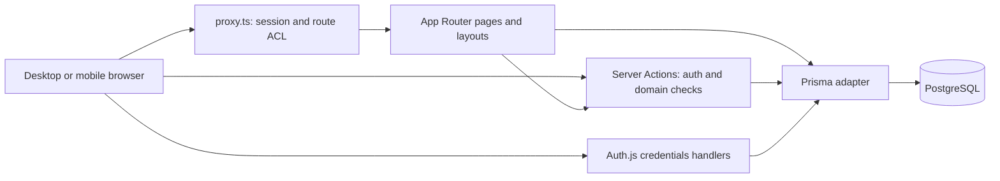
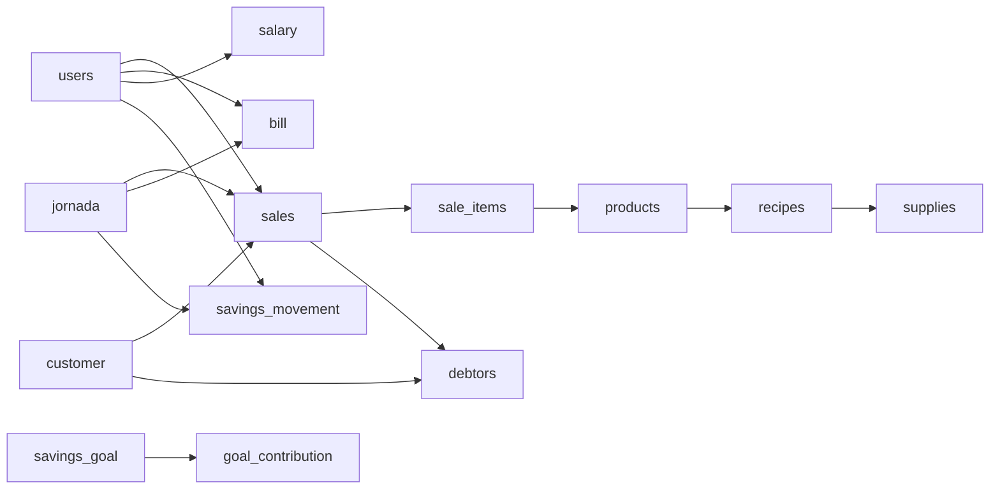

# Architecture

ComalPOS is a Next.js App Router monolith. Pages and Server Actions run in the
same application and use PostgreSQL through Prisma. There is no separate domain
API service, native mobile application, background scheduler or WebSocket service
in this repository.

## Request and data flow

- `proxy.ts` wraps `app/auth.config.ts`. Matched requests need a session, except
  guest access to `/login`. Denied roles and signed-in visits to login redirect
  to `/pos`. See [Request interception](docs/middleware.md).
- Server Components load data for pages. Client Components handle dialogs,
  optimistic updates, filters and calls to `lib/actions/`.
- Each business action checks its own session; selected writes and analytics also
  check ADMIN. Route permissions and action permissions are distinct. See
  [Authentication](docs/auth.md) and [Action reference](docs/actions.md).
- `app/api/auth/route.ts` exports Auth.js GET/POST handlers. Domain operations
  use Server Actions, rather than REST endpoints.
- `lib/prisma.ts` owns the runtime client and `@prisma/adapter-pg` connection pool.

## Code map

| Location | Responsibility |
| --- | --- |
| `app/(auth)/login/` | Role-specific login form |
| `app/(dashboard)/layout.tsx` | Authenticated shell, navigation, jornada banner and refresh |
| `app/(dashboard)/page.tsx` | Welcome page at `/` |
| `app/(dashboard)/pos/` | Desktop/mobile POS and optimistic sale reducer |
| `app/(dashboard)/debtors/`, `expenses/` | STAFF and ADMIN operational screens |
| `app/(dashboard)/admin/` | ADMIN management, jornada, statistics and reports |
| `components/layout/` | Sidebar, mobile menu, topbar, jornada banner, auto-refresh |
| `components/ui/` | Shared Radix/shadcn presentation primitives |
| `components/Sales-input-client.tsx` | Desktop account receipt, close/debt dialogs and customer picker |
| `components/Transfer-confirmation-dialog.tsx` | Shared transfer confirmation for POS and debts |
| `lib/actions/` | Domain reads/writes and shared schemas |
| `lib/analytics.ts` | Calendar, reporting types, formatting and CSV helpers |
| `lib/pos-source.ts` | Account source identifiers and display labels |
| `lib/auth.ts`, `app/auth.config.ts` | Credentials provider and shared JWT/session configuration |
| `lib/permissions.ts`, `lib/auth-types.ts` | Route ACL, known roles and normalization |
| `lib/prisma.ts` | Runtime client, pooled connection, development singleton |
| `lib/device-settings.ts`, `lib/store.ts` | Persisted per-browser state |
| `prisma/schema.prisma`, `prisma/migrations/` | Model and committed schema evolution |
| `prisma/seed.ts`, `prisma/sequence_fix.ts` | Demo data generation and sequence maintenance |
| `tests/integration/`, `tests/e2e/` | Database integration and browser tests |

The complete route list is in [Modules](docs/modules.md).

## Main domain relationships

Sales store historical unit prices/subtotals. Recipes and supply costs are
current catalog data; no historical recipe/cost snapshot is stored. Accounts are
grouped by `sales.source_type`; there is no separate account table.
`customer.currentBalance` is a stored balance changed during debt operations.
See [Database](docs/database.md) and [Business rules](docs/business-rules.md).

## Transactions and consistency

- `createSale` writes the sale, items, stock decrements and customer/debt changes
  in one interactive transaction.
- Quantity changes and cancellations adjust stock and sales in transactions.
- `toDebt` and `payAccount` read candidate sales first, then apply their writes
  with `$transaction`. The read and write are not a single locked operation.
- `addContribution` creates the contribution and conditionally completes the
  goal in a transaction.
- Analytics use `RepeatableRead` transactions with a 30-second timeout so a single
  query result has a consistent snapshot. A later export makes a fresh query.
- Jornada open checks, close aggregates, free-ticket selection and savings balance
  checks do not provide a database-level reservation/uniqueness guarantee.

These are the current boundaries, not a guarantee against every concurrent write.
Their concrete effects are recorded in [Business rules](docs/business-rules.md).

## Browser state and refresh

Desktop and mobile POS have separate views sharing the same actions. React
`useOptimistic` overlays add/remove/quantity changes; temporary sales have
negative IDs and cannot be edited until the server supplies a real ID.

`AutoRefresh` calls `router.refresh()` every 10 seconds while the tab is visible,
and on returning to the tab. It skips ticks during actions wrapped by
`trackAction`. `usePolling` refreshes client-loaded data at the same default
interval but does not use that action counter. This is polling, not push delivery.

`hasOpenJornada` and `getActiveJornadaWithStats` use `React.cache` to deduplicate
work within a server render. They are not a cross-request business cache.

- `useStore` persists the submenu, counter and user-name UI state in `app-storage`.
- `useDeviceSettings` persists only `deviceName` in `device-settings`. Hydration is
  requested after mount to keep the first client render aligned with the server.
- Business CLABE configuration is shared in PostgreSQL's `setting` table.
- Report CSV files are built in the browser from authenticated export data.
  Print output uses the browser print dialog, which can save a PDF.

## Runtime and deployment

The runtime uses `DATABASE_URL` with a pool maximum of four connections per
application instance. In development the client is reused through a global
singleton. Prisma CLI configuration loads `.env` and uses `DIRECT_URL`, falling
back to `DATABASE_URL` when unset.

`npm ci` runs `prisma generate` through `postinstall`. `npm run build` runs
`prisma migrate deploy` before `next build`, so it can change the selected
database. Deployment is configured for Vercel; no container or CI workflow is
checked in. See [Setup](docs/getting-started.md), [Deployment](docs/deploy.md) and
[Testing](docs/testing.md).

## Implemented scope

Statistics and Reports are implemented beta features. They describe paid sales,
expenses, salary payments, identified customers and current pending debts.
Optimiza/predictions remain unimplemented. Payment confirmation is manual;
there is no bank reconciliation integration. General collection timestamps,
historical profit and a complete cash-flow ledger are not available in the model.
