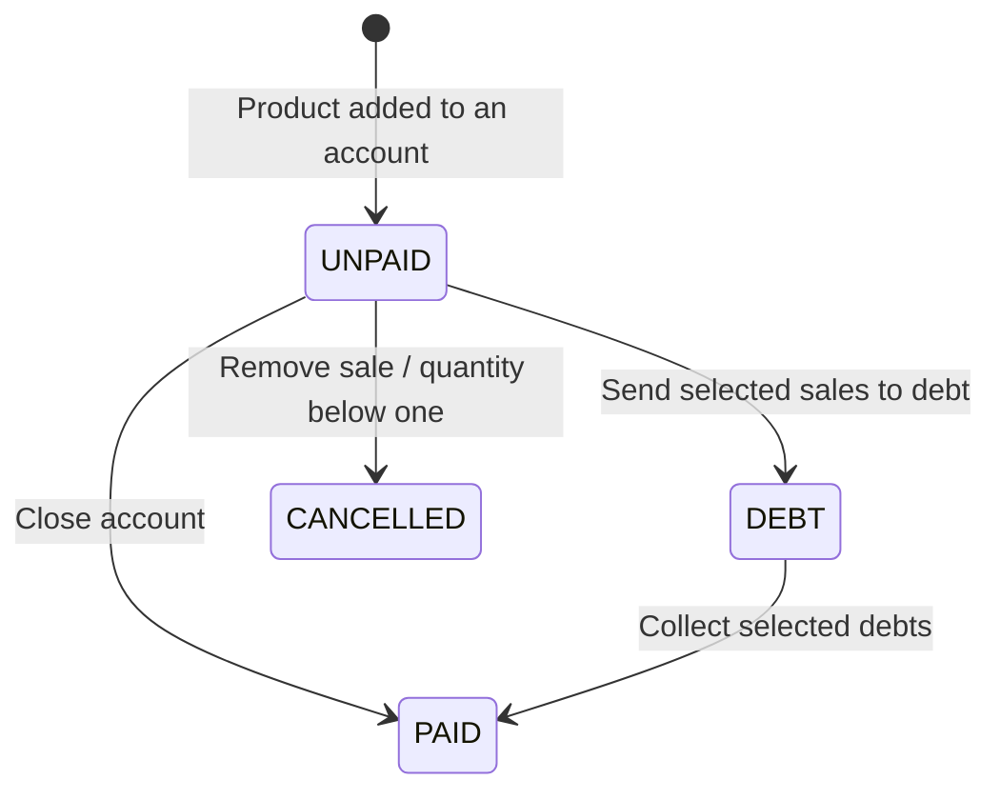

# Business rules

This is a reference to the behavior implemented on 2026-10-01, not a list of
planned requirements. Each section identifies the code responsible for the rule.
For function signatures and permissions, see [Action reference](actions.md);
for screens, see [Modules](modules.md).

## Terms

| Term | Meaning in this application |
| --- | --- |
| Jornada | Shared cash shift, open or closed; can be used by multiple users |
| Account | Group of sale records identified by `source_type` |
| Sale record | A persisted order entry; a POS product tap normally creates one record |
| Walk-in ticket | Reusable `VL-<n>` identifier for an open customer-of-passage account |
| Debt / fiado | Sale transferred to an identified customer for later full collection |
| Pool | Savings balance: all deposits minus all withdrawals |
| Goal contribution | Progress assigned to a savings goal; independent from pool movements |

## 1. Authentication and authorization

Sources: [`lib/auth.ts`](../lib/auth.ts),
[`lib/actions/auth_action.ts`](../lib/actions/auth_action.ts),
[`lib/permissions.ts`](../lib/permissions.ts).

- ADMIN login uses email/password; STAFF login uses username/exactly four numeric
  PIN digits. Password/PIN comparisons use bcrypt. `active === false` blocks login.
- Session JWT lifetime is eight hours and carries user ID/role. Role values other
  than ADMIN normalize to STAFF.
- Both roles can open POS, Egresos and Deudores. `/admin` routes require ADMIN.
- Actions check their own authorization. Most reads require only a session.
  ADMIN-only writes include product/supply/user changes, salary, jornadas,
  savings and settings. All analytics queries/exports require ADMIN.
- `saveCustomer` requires a session, although the CRM screen is ADMIN-only.
- Sale/expense/savings attribution and jornada open/close users come from the
  session. They are not operator-selected IDs.
- Existing sessions do not reread active/role state from the user table on each
  request. Deactivating a user blocks new logins; do not assume it immediately
  revokes an already issued session.

## 2. Sales and account lifecycle

Sources: [`sales.ts`](../lib/actions/sales.ts),
[`pos-source.ts`](../lib/pos-source.ts),
[desktop POS](../app/(dashboard)/pos/pos-manager.tsx),
[mobile POS](../app/(dashboard)/pos/MobilePosManager.tsx).

### Creation and inventory

`createSale` requires a session and an OPEN jornada. It reads product prices and
recipes from the database, computes `subtotal = price × quantity` and the sale
total, persists historical item unit prices/subtotals, and decrements each
supply by `quantityUsed × item quantity` in the same transaction.

A linked customer gets an updated `lastConsumption`. Customer ID `-1` or a falsy
ID means no customer. If creation explicitly uses DEBT with a customer, it also
creates the debt row and increments the customer's balance. The normal POS
creates UNPAID records and resolves them later.

No stock-availability check is performed before sale creation or quantity
increase. Stock can become negative. Creating sales does not runtime-parse all
arguments through `SaleItemsSchema`/`SalesSchema`; their TypeScript types alone
do not enforce positive quantities, valid sources or payment methods.

### Source identifiers

| Source | Account meaning |
| --- | --- |
| `MESA_<n>` | Table |
| `CL- <name>` | Customer selected from CRM |
| `VL-<n>` | Open walk-in ticket |
| `VENTA_LIBRE` | Settled walk-in history |

The server chooses the lowest positive walk-in number unused by UNPAID sales
in the active jornada. Selection does not reserve the number: simultaneous
requests can choose the same number. Customer account identity uses a name
string rather than the customer primary key; duplicate/changed names can affect
grouping. See the 30-character source limit in [Database](database.md).

### Normal state transitions



- `closeAccountAction` updates only UNPAID records with the source in the active
  jornada. It sets PAID and CASH/TRANSFER. For a well-formed walk-in ticket it
  also rewrites the source to VENTA_LIBRE, freeing its number.
- A close with no matching records can return success with `count: 0`.
- Payment or debt conversion clears the account view and returns to venta libre.
  Switching views by itself does not settle an account.
- Account views display UNPAID records. The POS dataset is today's non-cancelled
  sales, using the server's local day; it is not a complete cross-day open-account
  recovery screen.
- `updateSaleQuantity` adjusts stock by the difference from the old quantity,
  keeps the stored unit price, recalculates subtotal and sale total. Quantity
  below one calls cancellation for the whole sale.
- `cancelSaleAction` restores stock using the product's current recipes, marks
  the sale CANCELLED and keeps its rows for audit. Repeating cancellation fails.

The diagram describes the normal UI flow. The cancellation/quantity actions
do not themselves restrict edits to UNPAID sales or require an OPEN jornada.
Cancellation does not reverse a linked debtor row/customer balance.
Recipe changes after sale creation can also change the amount restored on
cancellation because recipes are not snapshotted.

## 3. Payment confirmation

Sources: [desktop payment dialog](../components/Sales-input-client.tsx),
[mobile POS](../app/(dashboard)/pos/MobilePosManager.tsx),
[debt payment dialog](../app/(dashboard)/debtors/debt-payment-dialog.tsx),
[transfer confirmation](../components/Transfer-confirmation-dialog.tsx).

| Flow | Cash | Transfer |
| --- | --- | --- |
| Desktop POS | Receipt and explicit confirmation button | Shared transfer confirmation |
| Mobile POS | Required received amount and change calculator before confirmation | Shared transfer confirmation |
| Deudores, desktop/mobile | Required received amount and change calculator before confirmation | Shared transfer confirmation |

- Mobile POS and debt cash inputs accept a nonnegative decimal with up to two
  places, using dot or comma, without thousands separators. The parsed value must
  fit safe integer cents; empty/invalid/insufficient amounts block confirmation.
- Change is `received cents - sum(round(each sale total × 100))`. An insufficient
  amount displays how much is missing. The mobile POS cash input's Enter key
  blurs the input without recording payment; recording uses the button.
- Received cash and calculated change are local UI state; they are not sent to
  the action or stored in the database.
- Transfer confirmation loads the business CLABE, shows the total and asks the
  operator to confirm receipt. Loading blocks confirmation. An empty CLABE shows
  a notice but does not block the final confirmation after loading.
- Cancelling either confirmation does not pay the account.
- Transfer receipt is manually asserted. There is no bank lookup, automatic
  reconciliation or stored receipt-verification token.

The server settlement actions accept a payment method and update status.
They do not require proof of either UI confirmation.

## 4. Debts and customer balance

Source: [`debts.ts`](../lib/actions/debts.ts).

- `toDebt` selects nominated sale IDs that are currently UNPAID and takes their
  amounts from the database. It upserts one debtor row per sale, sets sales DEBT,
  assigns the customer and increments `currentBalance`.
- `payAccount` selects nominated sale IDs currently DEBT and uses database
  totals. It sets debtor rows PAID with `paidAt`, sets sales PAID with the method,
  and decrements the given customer's balance.
- No selected eligible sales returns `NO_UNPAID_SALES` / `NO_DEBT_SALES`.
- Collection is full settlement of selected sales; no partial-payment action
  or payment allocation ledger is implemented.
- Debtor lists group DEBT rows by customer. The summary totals all DEBT rows,
  distinct customer IDs and PAID debt amounts whose `paidAt` is today.
- Debt collection does not require an open jornada and preserves the sale's
  original jornada/creation date. It does not record a new current-jornada receipt.

The selection queries do not independently verify every nominated sale belongs
to the given customer or current jornada. Reads occur before the transaction's
writes, so duplicate/concurrent calls are not a fully protected idempotent payment
protocol. Stored customer balance and old jornada totals can change when debts
are collected. Cancellation and analytics have different exclusion behavior; see
section 10.

## 5. Jornadas and cash

Source: [`jornada.ts`](../lib/actions/jornada.ts),
[jornada UI](../app/(dashboard)/admin/jornada/jornada-manager.tsx).

- Only ADMIN opens/closes a jornada, including one opened by another ADMIN.
- Opening and counted closing cash must be finite and at least zero.
- Opening fails with `PENDING_JORNADA` if a query finds an OPEN jornada.
  There is no auto-close or unique database constraint guaranteeing only one.
- Closing rejects missing/already closed jornadas. Any UNPAID source in the
  jornada blocks it with `OPEN_ACCOUNTS`, including account counts and totals.
  Pay, convert to debt, or cancel these entries before closing.
- Sales creation, account closure, expense creation and savings pool movements
  require an OPEN jornada. Salary payments and goal contributions do not.
- PAID sales with CASH or a null method count as cash. TRANSFER sales are shown
  separately. UNPAID, DEBT and CANCELLED sales do not count as cash receipts.
- All linked bills reduce cash; bills have no payment-method column.
- Savings deposits remove money from the drawer; withdrawals put money back.

```text
expected cash =
    opening amount
  + paid cash sales (including null payment method)
  - linked expenses
  - linked savings deposits
  + linked savings withdrawals

closing difference = physically counted cash - expected cash
```

Example: opening 500 + cash sales 300 - expenses 50 - deposits 100 + withdrawals
20 = expected cash 670. A counted amount of 650 is a difference of -20.
Transfer sales are outside this formula. Salary rows are also outside it because
they have no jornada relation and do not automatically create bills.

The action stores CLOSED, closing user/time, expected and actual amount.
The active summary reports `NO_JORNADA`, `OWN_OPEN` or `OTHER_OPEN`.
Employee breakdown counts PAID sale records and totals by placing user, not
customer visits. STAFF sees a read-only banner.

Closing checks, sums and the final update are separate queries rather than an
isolated closing transaction. Do not assume they block simultaneous POS writes
or reconstruct later collection of an old debt.

## 6. Inventory, recipes and menu prices

Sources: [`inventory.ts`](../lib/actions/inventory.ts),
[`products.ts`](../lib/actions/products.ts),
[shared schemas](../lib/actions/schemas.ts).

- Supply writes/deactivation require ADMIN. Name/unit are nonempty, manually
  saved stock is nonnegative, and `unitCost` is at least 1 under `SupplySchema`.
- Listing returns active supplies alphabetically. Delete sets `active: false`.
  Existing recipe references remain.
- The desktop/mobile inventory unit pickers offer `kg`, `g`, `Lt` and `piece`.
  No automatic conversion between kilograms/grams or litres exists.
  Stock, recipe quantity and unit cost must use the same unit.
- Desktop/mobile inventory filters use stock > 0 for "in stock", stock <= 0 for "out of
  stock"; the list contains only active supplies. Desktop/mobile name search is
  available.
- Product writes/deletion require ADMIN. Product name has a minimum of three
  characters and price must be positive.
- With a supplied nonempty recipe, the server checks
  `price >= sum(current supply unitCost × quantityUsed)`.
- Supplied recipes replace the previous set; an explicit empty array removes it.
  Omitted recipes preserve it and skip that base-cost comparison. Recipe quantity
  positivity is not enforced by `ProductSchema`.
- Foreign-key references can prevent physical product deletion.
- Menu displayed base cost and utility use current recipes/costs:
  `utility per unit = sale price - base cost`. This is not historical profit.

## 7. CRM and users

Sources: [`customers.ts`](../lib/actions/customers.ts),
[`users.ts`](../lib/actions/users.ts), [CRM](../app/(dashboard)/admin/crm/crm-manager.tsx).

- Customer creation/update saves name and optional phone only. Name needs at
  least three characters; blank phone becomes null. New customers get balance 0
  and registration date now. Balance/alias are not editable through this action.
- Customer search is server-side, case-insensitive on name/alias; default limit
  20. The POS picker debounces by 300 ms.
- CRM supports name filtering, most-recent registration first (default), or
  Spanish name A-Z. Null dates sort last; IDs break ties.
- Staff search matches name/username, defaults to 20 results and does not filter
  only active staff roles.
- `GetAllUsers` returns `hasPassword` / `hasPin` flags; credential hashes stay
  on the server.
- ADMIN creates/edits users. A new nonempty credential is required; it is bcrypt
  hashed with cost 10. STAFF uses PIN, ADMIN uses password. Supplying a replacement
  credential clears the other credential field.
- Editing without a replacement leaves the stored credentials unchanged.
  Updating email/username is not implemented in `saveUser`'s update payload.
- Usernames are generated from the name's initials/surnames plus random digits.
  An ADMIN created without an email gets a generated `@demo.com` address.
- The generator assumes a given name and surnames; short name formats can fail
  even when they pass the schema's minimum length. Username/email uniqueness is
  not enforced by the database schema.
- Save-time schemas use name/role and selected credential fields; they do not
  enforce every login constraint. Login separately requires four numeric PIN
  digits. Changing a role without the matching credential can leave login unusable.

## 8. Expenses and salary payments

Sources: [`expenses.ts`](../lib/actions/expenses.ts),
[`payrolls.ts`](../lib/actions/payrolls.ts),
[salary UI](../app/(dashboard)/admin/roster/page.tsx).

- Authenticated users register expenses in an OPEN jornada. Amount must exceed
  zero, description must be nonempty and date must be a Date. Category is optional
  in the shared schema. `registered_by` comes from the session.
- The expense form requires a category and a trimmed nonempty description.
  Categories are Insumos, Servicios, Mantenimiento and Otros; the server schema
  does not restrict category strings to this picker.
- Expense history pages default to 30 rows, ordered by date then ID descending.
  The returned total is all-time, not merely the loaded page.
- ADMIN records salary payment with an integer user ID, positive amount and
  nonempty period. `payDate` is now, stored as a calendar date.
- Salary UI offers ADELANTO, BONO and SUELDO. The period string stores
  `<type>: <reason>`; these are labels, not a salary-type database enum.
- The UI shows a movement summary followed by explicit confirmation before
  saving. No salary reversal/update/delete action exists.
- Salary history is per user, 30 rows by default, ordered by payment date then ID.
  User selection searches the server with a 300 ms debounce.

## 9. Savings and goals

Source: [`savings.ts`](../lib/actions/savings.ts).

- Pool balance is all DEPOSIT amounts minus all WITHDRAW amounts.
- ADMIN pool movement amount must be finite/positive and an OPEN jornada is
  required. Withdrawals above the queried pool balance fail.
- Movements record the session user and jornada. Default movement page is
  `getRecentMovements(limit = 20, offset = 0)`; note the limit-first signature.
- ADMIN creates/edits goals with nonblank name and finite positive target; deadline
  and description are optional. Cancelling sets CANCELLED.
- ADMIN contributions must be finite and positive. Contributions are independent
  of the pool: they neither withdraw pool money nor require an open jornada.
- In the contribution transaction, an ACTIVE goal becomes COMPLETED when its
  total contributions reach/exceed target. Progress display is capped at 100%.
- The action does not reject a contribution just because a goal is already
  COMPLETED/CANCELLED; only ACTIVE goals auto-transition.

Pool balance validation and movement insertion are separate operations, so
concurrent withdrawals are not protected by a single locked balance update.
Goals/contributions have no implemented delete or reversal action.

## 10. Statistics and reports (beta)

Sources: [`analytics.ts` actions](../lib/actions/analytics.ts),
[analytics helpers](../lib/analytics.ts).

- Queries/exports require ADMIN and validated `from`/`to` calendar dates with
  `from <= to`. Default is 30 days including today; shortcuts include today and
  seven days. Custom ranges and report type/page travel in the URL.
- Sales are filtered by creation date and current PAID status, never payment date.
  A product tap can be a sale record: `paidRecords` is not account/visit count
  and no average-ticket metric is provided.
- Date/time grouping is America/Mexico_City; bill/salary `@db.Date` values keep
  calendar-date meaning. Endpoints include both chosen dates, implemented as
  start-inclusive/next-day-exclusive query ranges.
- Comparison uses the immediately preceding interval with the same number of
  calendar days. Zero previous amount/units yields percentage null.
- Statistics include amount, units, paid records, identified customer count;
  daily/hour/weekday distribution, products, payment methods and account origin;
  expenses by category, salaries by user, and identified customer purchases/days.
- Product sums use historical item quantities/subtotals; current catalog prices
  do not reprice past sales. Product/customer names use current related records.
- A null sale total falls back to item subtotals with a notice. If total and items
  are absent, the monetary amount is unknown and excluded from monetary sums
  with a notice. Undated expenses/salaries are excluded with a notice.
- Failures return permission/filter/query errors, not fabricated zero results.

| Report type | Included records / date |
| --- | --- |
| `sales` | Current PAID sales, by creation timestamp |
| `products` | Item aggregates of those PAID sales |
| `expenses` | Bills by calendar date |
| `salaries` | Salary rows by payment calendar date |
| `customers` | Identified customers linked to PAID sales in the period |
| `debts` | Current DEBT rows with positive amount, null paidAt and a linked sale still DEBT, by original sale date |

Debt ages are calendar days from the original sale to query day, clamped to zero.
The debt report is current pending balance for origins in the range, not the
balance as of a historical closing date. It deliberately excludes settled and
cancelled sale debts; the operational debt list checks debtor status alone.

Report pages show 50 rows; out-of-range pages clamp to the last available page.
Exports query all matching rows with complete totals, independently of the visible
page. A later export can differ if the database changed.

CSV uses UTF-8 BOM, quoted/escaped fields, CRLF, a total row and monetary decimals
without thousands separators. Text that resembles spreadsheet formulas is
prefixed to neutralize execution. Print includes all matching rows/totals via
browser printing; saving PDF depends on that browser.

No forecasts, historical recipe profit, general collection ledger or exact
cash-flow reconstruction is implemented.

## 11. Business and device settings

Sources: [`settings.ts`](../lib/actions/settings.ts),
[`device-settings.ts`](../lib/device-settings.ts).

Any session can read CLABE for payment screens; only ADMIN saves it.
CLABE may be blank or exactly 18 digits after trimming outer whitespace.
The settings form removes non-digit characters while typing; the server action itself
does not accept embedded spaces.
Validation checks length/digits, not bank ownership or a CLABE checksum.
The value is upserted under the shared `CLABE` key.

Device name is stored per browser in `localStorage` and never sent to the server.
Clearing browser data removes it. Its hydration flag is transient and not
persisted. See [Architecture](../ARCHITECTURE.md) for refresh and browser state.
