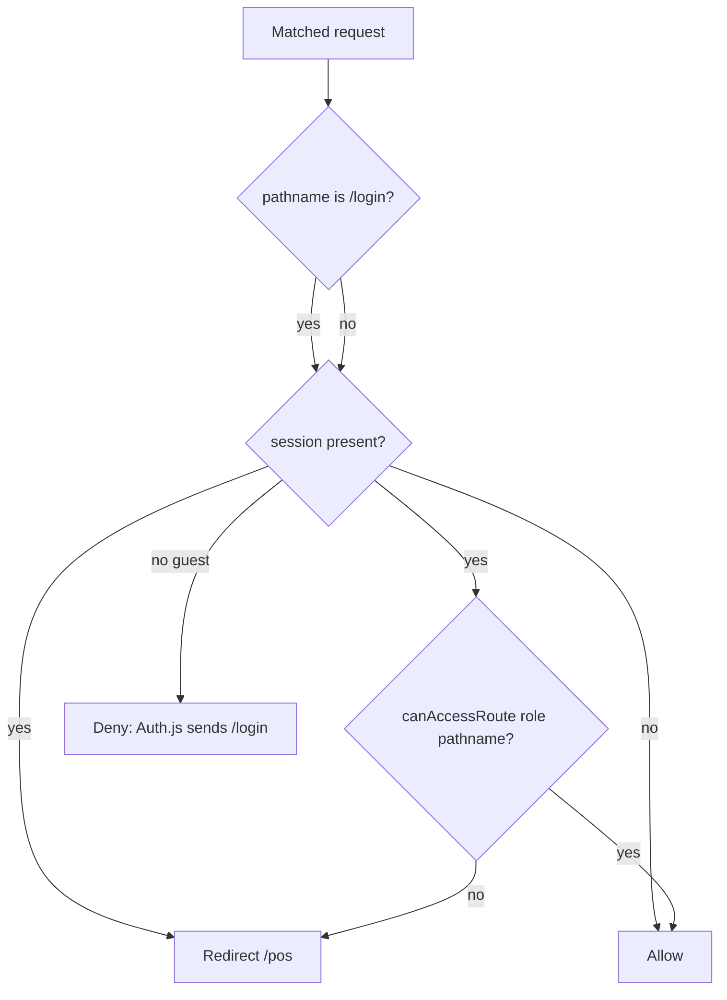

# Middleware (proxy)

The Edge intercept file is [`proxy.ts`](../proxy.ts), not `middleware.ts`.
Next.js 16 renamed that entry point. Do not add a `middleware.ts` — it
will not run.

```ts
export default NextAuth(authConfig).auth;

export const config = {
  matcher: "/((?!api|_next/static|_next/image|icon.svg).*)",
};
```

The export is Auth.js’s wrapper around [`app/auth.config.ts`](../app/auth.config.ts).
Providers stay in [`lib/auth.ts`](../lib/auth.ts); the proxy config uses
`providers: []` so the Edge bundle does not pull Prisma or bcrypt.

## Matcher

The proxy runs on every path **except**:

- `api` — so [`app/api/auth/route.ts`](../app/api/auth/route.ts) (`GET` /
  `POST` handlers) stays reachable
- `_next/static`, `_next/image`
- `icon.svg`

A guest hitting `/pos` is sent to `/login`. A guest hitting `/api/auth/*`
is not intercepted here.

## `authorized` flow

Callback in `auth.config.ts`. Redirects to `/pos` are safe: every role
can open that route, so the check cannot loop.



1. `/login` + session → redirect `/pos`. `/login` + guest → allow.
2. Any other matched path + guest → deny (Auth.js uses `pages.signIn`:
   `/login`).
3. Session + `canAccessRoute` fails → redirect `/pos`.
4. Otherwise allow.

`jwt` and `session` callbacks copy `id` (`token.sub`) and a normalized
role onto the session. See [auth.md](auth.md) for login and token lifetime.

## ACL

[`lib/permissions.ts`](../lib/permissions.ts) is the single route ACL.
The sidebar and mobile nav use the same module so hidden links match
server enforcement.

Rules are first-prefix-wins:

| Prefix | Roles |
| --- | --- |
| `/admin` | ADMIN |
| `/pos` | ADMIN, STAFF |
| `/expenses` | ADMIN, STAFF |
| `/debtors` | ADMIN, STAFF |

An authenticated path that matches no prefix is allowed. The proxy still
requires a session.

This file is bundled into the Edge proxy: **no Prisma, no Node APIs**.

## What it does not cover

Server Actions are not page navigations. The proxy does not run on the
action POST the way it does on `/pos`. Every action must call `auth()`
itself ([TECHNICAL.md](../TECHNICAL.md)). Do not treat the proxy as
protection for mutations.

## Extending

- New **admin** page under `/admin/...` — already covered by the `/admin`
  prefix. Add nav only.
- New **staff-visible** route (not under `/admin`) — add a
  `ROUTE_PERMISSIONS` entry, then the nav links.
- Do not import Prisma or Node APIs into `proxy.ts`, `auth.config.ts`, or
  `permissions.ts`.
