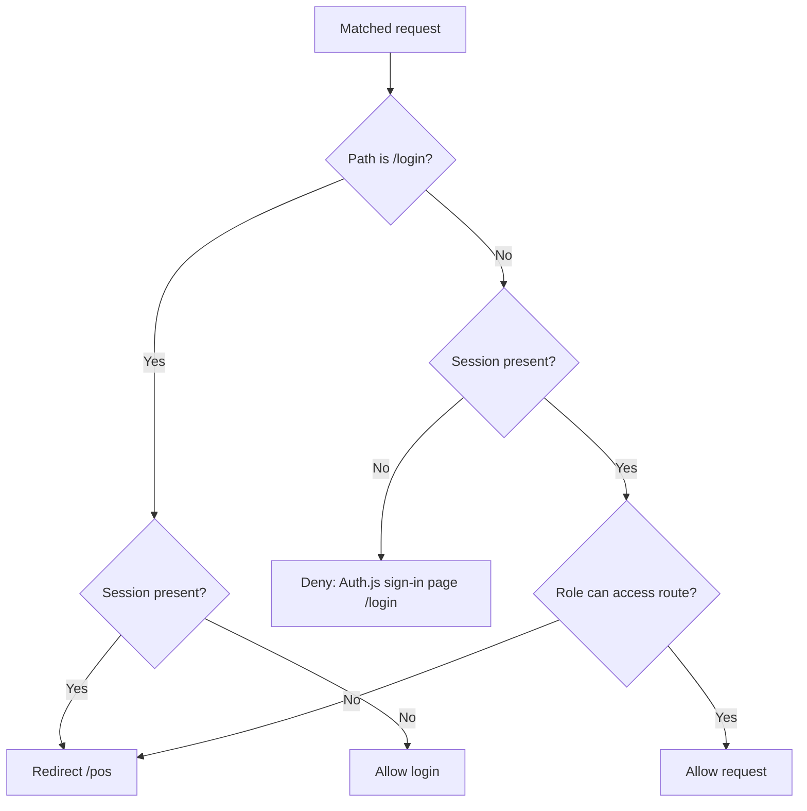

# Request interception (proxy)

The repository uses [`proxy.ts`](../proxy.ts) as its Next.js 16 request entry
point. It wraps Auth.js with the shared
[`app/auth.config.ts`](../app/auth.config.ts).

```ts
export default NextAuth(authConfig).auth;

export const config = {
  matcher: "/((?!api|_next/static|_next/image|icon.svg).*)",
};
```

## Matcher

The matcher excludes paths beginning with `api`, `_next/static`, `_next/image`
or `icon.svg`. In particular `/api/auth` remains reachable by the authentication
handlers. Other matching paths run the authorized callback.

The shared config has `providers: []`. The credentials provider, Prisma and
bcrypt stay in `lib/auth.ts` rather than the request-interception configuration.
This separation is about imports and responsibilities; it does not describe an
additional domain API.

## Authorized callback


```mermaid
flowchart TD
    R[Matched request] --> L{Path is /login?}
    L -->|Yes| S{Session present?}
    S -->|Yes| P[Redirect /pos]
    S -->|No| A[Allow login]
    L -->|No| H{Session present?}
    H -->|No| N[Deny: Auth.js sign-in page /login]
    H -->|Yes| C{Role can access route?}
    C -->|No| P
    C -->|Yes| O[Allow request]
```

1. Guest on `/login`: allow.
2. Signed-in user on `/login`: redirect to `/pos`.
3. Guest on another matched path: return false; the sign-in page is `/login`.
4. Signed-in user denied by `canAccessRoute`: redirect to `/pos`.
5. Otherwise allow.

Both roles can open `/pos`, so the denied-role redirect has a permitted target.
The JWT/session callbacks carry user ID and role; details are in
[Authentication](auth.md).

## ACL and Server Actions

`ROUTE_PERMISSIONS` uses whole-segment prefixes, first rule wins, and unmatched
authenticated paths are permitted. Navigation uses the same ACL, but function
permissions remain independent.

Do not assume the proxy always skips action POST requests: its matcher is based
on request paths. A route-level check does not validate which domain function is
being called or its arguments. Every action must check its own session/role and
business rules. See [Action reference](actions.md).

## When changing routes

An existing `/admin/...` page is covered by the ADMIN rule. New operational paths
should have the intended ACL entry and corresponding navigation updates.
Keep shared ACL/config imports independent of Prisma, bcrypt and provider
database work. The checked-in interception file is `proxy.ts`; preserve that
entry point when working on this application.
